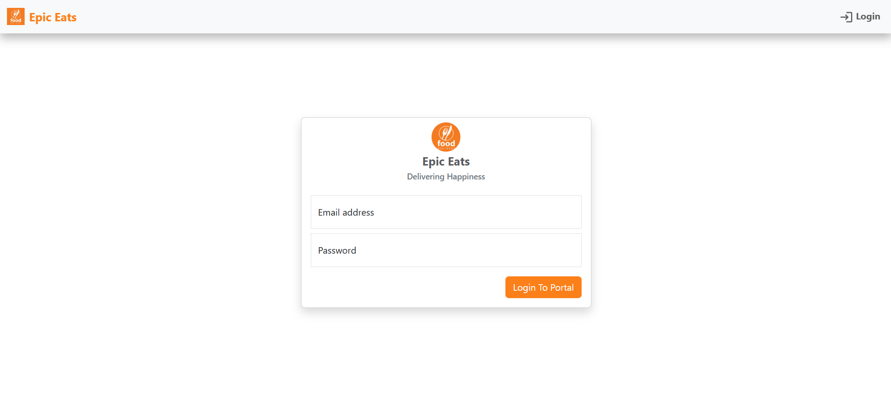

# 🚀 EpicEats – Food Ordering Platform

EpicEats is a **springboot** application that allows users to **select restaurants, choose favourite foods and order their favourite foods** 

---


## 🏗️ Tech Stack

- **Frontend:** React.js(pending)
- **Backend:** Springboot(microservice)
- **Database:** MySQL
- **Authentication:** JWT, RSA
- **Deployment:** Docker, AWS
- **Dev Tools:** Postman

---

## 🛠️ Installation & Setup

### 🔧 **1. Clone the Repository**

```sh
git clone https://github.com/your-username/Epic_Eats_Backend.git
cd Epic_Eats_Backend
```


### 🎓 **2. Running the application**

```sh
# Run the application using docker-compose

#Starting apache-kafka
cd infrastructure
docker-compose -f zookeeper.yml up -d
docker-compose -f kafka_cluster.yml up -d
docker-compose -f init_kafka.yml up -d


# start the application
cd ..
docker-compose up -d
```

###  **Screenshots**



